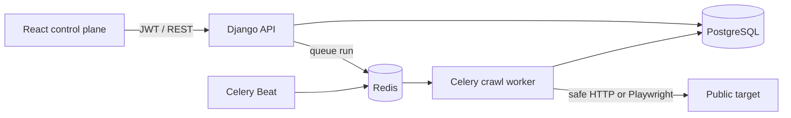

# Scrapoo architecture

Scrapoo separates the user-facing control plane from the crawl data plane so browser-heavy jobs cannot make the dashboard unreliable.

## Reliability boundaries

- The API validates ownership and crawl configuration before enqueueing work.
- Redis buffers work; Celery acknowledges tasks late and limits prefetch so interrupted jobs can be recovered.
- Workers enforce URL, redirect, response-size, depth, page-count, retry, time, and spend limits.
- PostgreSQL is authoritative for projects, runs, pages, field-health metrics, and the event audit trail.
- The React interface can be deployed independently and connects through `NEXT_PUBLIC_API_BASE_URL`.

## Security model

- Only HTTP(S) crawl targets are accepted.
- Credentials embedded in target URLs are rejected.
- DNS answers are checked and non-public address ranges are rejected before requests and redirects.
- Browser subrequests are intercepted; private targets and unnecessary media are blocked.
- Authorization and cookie response headers are not persisted.
- JWT authentication and owner-scoped querysets prevent cross-workspace data access.

DNS validation materially reduces SSRF risk, but production infrastructure should add an outbound firewall that denies RFC 1918, loopback, link-local, metadata-service, and internal network ranges. Network egress policy is the final control against DNS rebinding.

## Next production increments

1. Put raw HTML and large exports in object storage while retaining metadata in PostgreSQL.
2. Add organization membership, roles, API keys, and audit-log exports.
3. Add proxy-provider adapters with per-provider cost accounting and health checks.
4. Add parser version rollbacks and side-by-side selector tests against saved samples.
5. Add OpenTelemetry traces, Prometheus metrics, and alert routing.
